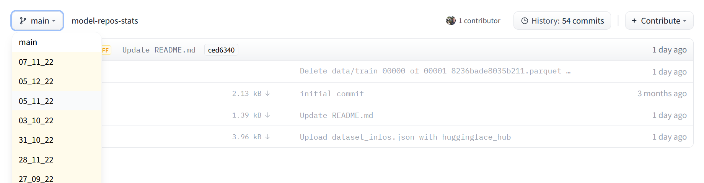

# OpenAI License Research - Method

## General assumptions and terminology

HuggingFace uses a system of git repositories effectively similar to GitHub, which can contain both code and datasets, but can also be completely empty. The assumptions I based my work on were the following:

- We are interested in the license that is used by the repository and we are taking the repository's creator choice as reflective of their intention, independently from the fact that they might have misunderstood the license or its scope.
- The number of downloads per repository that is displayed for each timestamp is always based on the previous 30 days. This is a limitation of HuggingFace’s data.
- Given its low barrier to entry and the way similar platforms such as GitHub are used, it is realistic to assume that most people would be using HuggingFace as a personal storage and version control tool, thus inevitably have little to no interest in effectively protecting their work with any license. This is partially reflected by the fact that, while out of the total 100+ thousand repositories present on HuggingFace, only around 30% have a specific license associated to them, this percentage grows to over 40% when taking into consideration only the repositories with more than 30 cumulative downloads across the whole time period [as counted via the method specified below](#running-the-analysis).
- Partly as a consequence of the previous point, most repositories have few or zero downloads. We used the number of downloads as a proxy for interest in a repository and its relevance and we repeated the analysis on a subset of repositories filtered by cumulative downloads to understand if there were any particular differences in license usage (among the repositories that actually had one).
- We assumed that most repositories would not change name frequently and used the name of each repository (coupled with the author's name) as an ID. This ID would be unique due to the fact that they are the URL to the repository's page, but this is still an assumption to highlight since its uniqueness is relevant to the way we currently count cumulative downloads. The assumption will be tested or made obsolete by using a different ID for any future reseearch. 

## Collecting materials

### HuggingFace datasets

At least since September 2022, HuggingFace has been saving their repositories’ metadata every week in their [model-repo-stats repository](https://huggingface.co/datasets/open-source-metrics/model-repos-stats). In this repository, the `main` branch contains the most up to date dataset, while all other branches are named with the date on which the dataset they contain was exported, like this:



**Note:** There appears to be an error from HuggingFace and the 10_10_2022 dataset is also present in a branch called 10_01_2022.


### Licenses categorisation

A full list of licenses with the relevant `license_id` (which is the id present in the dataset) can be found on HuggingFace’s [Licenses page](https://huggingface.co/docs/hub/repositories-licenses).

Beside analysing the usage of each license, we also categorised each license according to its permissiveness, as reported in the `licenses.csv` file. As an illustratory example, this is what the file looks like:

| license_id            | license                                      | category                |
|-----------------------|----------------------------------------------|-------------------------|
| bigscience-openrail-m | BigScience OpenRAIL-M                        | RAIL                    |
| afl-3.0               | Academic Free License v3.0                   | Permissive / BY         |
| c-uda                 | Computational Use of Data Agreement          | Other use restrictions  |
| cc0-1.0               | Creative Commons Zero v1.0 Universal         | No restrictions / PD    |
| cc-by-sa-4.0          | Creative Commons Attribution Share Alike 4.0 | Copyleft / SA           |
| ...                   | ...                                          | ...                     |
Categorising the licenses highlighted some issues with the starting data and forced us to make some choices that we detailed below.

#### Unknown and other

HuggingFace allows for the use of `unknown` and `other` as license_id. These IDs are used by approximately 1500 repositories, 500 using `unknwown` and 1000 using `other`. 

Given the fact that it is possible to avoid declaring a license (in fact, around 70% of repositories have no license whatsoever), it is unclear why HuggingFaces would allow the `unknown` id. 

The use of `other` should in theory be accompanied by the creation of a `LICENSE` file in the repository, as per HuggingFace [Licenses page](https://huggingface.co/docs/hub/repositories-licenses), but that is not an actively enforced rule. Given that among the 1000 `other` tagged repos we saw many with tens of thousands of downloads, often from large and influential companies, we tried retrieving these licenses with a combination of scripting and manual search, which proved somewhat challenging but might provide an avenue for future research. 

#### License families

On their [Licenses page](https://huggingface.co/docs/hub/repositories-licenses), Hugging Faces presents both actual licenses and license families as valid choices for their repositories. This means that many repositories have license_id such as `openrail` or `bsd` which are not linked to a specific license text. 

According to a response we received from HuggingFace, the idea behind this was to allow more flexibility to users.

The solution we found was:

- Wherever possible, extend category and type to the “family” denomination. For example, all RAIL licenses are in the `RAIL` category, so the generic `openrail` license family is also categorised as such.
- When that was not possible, that license_id was marked as `non-categorizable`. In total this affected less than 300 models, only one with around 2k downloads (all the others normally had 0 or less than 20), and the relevant license IDs were the `cc` one, generally indicating the Creative Commons license family, and `odbl` one indicating the Open Database license family.

#### Lists of licenses
As explained in the [Models explorer](https://huggingface.co/spaces/open-source-metrics/models-explorer) built by HF, in the past they allowed users to list more than one license. This has led to multiple repositories having a list-like `license_id` value, i.e. `['apache-2.0']` instead of `apache-2.0`, as well as some having more than one license. 

The first problem has been addressed by searching and replacing the characters that identify a “list” programmatically (`[`, `]` and `'`), since they are not used in any other license.

The second issue affected only a small number of repositories, most of them created by the same author and using two licenses, one covering the code and the other the dataset which the author got from another source. 
As such, only the license for the code has been kept (which was always `apache-2.0`) and the code targets these specific cases. In one case, one of the two licenses was the generic `other` which indicated Meta's OPT-175b license, so we kept `other` for the purpose of this analysis.

## Running the analysis

After collecting the necessary data, we created a few connected Python scripts that would do the following:

1. Import the .parquet datasets downloaded from HuggingFace [model-repo-stats repository](https://huggingface.co/datasets/open-source-metrics/model-repos-stats)
2. Create a CSV file per each timestamp counting the number of repositories using each license and summing the total downloads those repositories had
3. Create a CSV file per each timestamp grouping the licenses into our categories and counting repositories using it as well as total downloads those repositories had
5. Sum all downloads for each repository across the timestamps into one number per repository, then using this to extract a list of repositories with more than 30 cumulative downloads
6. Using the list of repositories to filter the datasets and repeat steps 2 to 4

### Outputs

The CSV produced by running the analysis we used for our paper are available in the `output` folder using the structure illustrated below:
```
output
├── general
│   ├── 27_09_2022.csv
│   ├── 27_09_2022_categories.csv
│   ├── 31_10_2022.csv
│   ├── 31_10_2022_categories.csv
│   └── ...
└── filtered
    ├── 27_09_2022.csv
    ├── 27_09_2022_categories.csv
    ├── 31_10_2022.csv
    ├── 31_10_2022_categories.csv
    └── ...
```

The `general` folder provides data on the full dataset of around 100 thousand repositories (the dataset grew from less than 80 thousand to over 120 thousand by the latest export on 24/01/2023). On the latest timestamp, approximately 40 thousand repositories had a specified license.

The `filtered` folder only uses repositories with more than 30 cumulative downloads [as counted via the method specified above](#running-the-analysis). With the latest dataset, this reduced the number of analysed repositories to approximately 25 thousand, of which 11 thousand had a specified license. 

## Library use

### Introduction

When we observed that number of repositories using RAIL licenses was increased, we also noted that they appeared to be often using Stable Diffusion, a text-to-image model that was released in 2022 and garnered signficant popularity. This intuition was partially supported by the fact that, while Stable Diffusion’s code is licensed under the MIT license, the model itself is hosted on HuggingFace by its three creators, all using under the CreativeML Open RAIL++-M License:
* [StabilityAI](https://huggingface.co/stabilityai/stable-diffusion-2/blob/main/LICENSE-MODEL)
* [RunwayML](https://huggingface.co/runwayml/stable-diffusion-v1-5)
* [CompVis](https://huggingface.co/CompVis/stable-diffusion)

To verify this intuition quantitatively, we used the `library` tag which some HuggingFace repositories use. This tag is explained in more detail in the [relevant documentation on HuggingFace's website](https://huggingface.co/docs/hub/models-libraries), but it basically allows users to identify the libraries they are using in their repository. 

One of such libraries is called Diffusers (with the id `diffusers`) and, as [this HuggingFace blog post](https://huggingface.co/blog/stable_diffusion) illustrates, it appears to be the main way to signal usage of diffusion models such as Stable Diffusion and others. All three aforementioned official repositories hosting the Stable Diffusion model suggest users to either use the code on GitHub or rely on the Diffusers library, and two of them (CompVis excluded) are themselves tagged with it.

### Methodology

With the data used for the base analysis, we scoped this further investigation to the repositories using a RAIL license (using the categorisation described above).

After this initial selection, we used a Python script to:

1. Group all repositories by the library they used
2. Exclude all those not declaring any library
3. Count the number of repositories per library used
4. Repeat the analysis using a download threshold of 30 cumulative downloads across the four timestamps

### Limitations and assumptions

- While there seems to be significant overlap between usage of Stable Diffusion and the `diffusers` tag, the two are not mutually interchangeable and further qualitative analysis should be conducted to verify what can actually be said about the usage of the `diffusers` tag.
- One important point is that over 60% of the repositories (when not filtered by downloads) were consistently indicating no library whatsoever. This value peaked at 80% on one specific timestamp, the 31st of October 2022, and then returned to 67% and then 62%.
- When the analysis was repeated on repositories with over 30 cumulative downloads, the number of those without a library fell to 1 or 2 per each timestamp, with the exception of 8 (representing almost 9% of the total repositories) on 31st October 2022.
